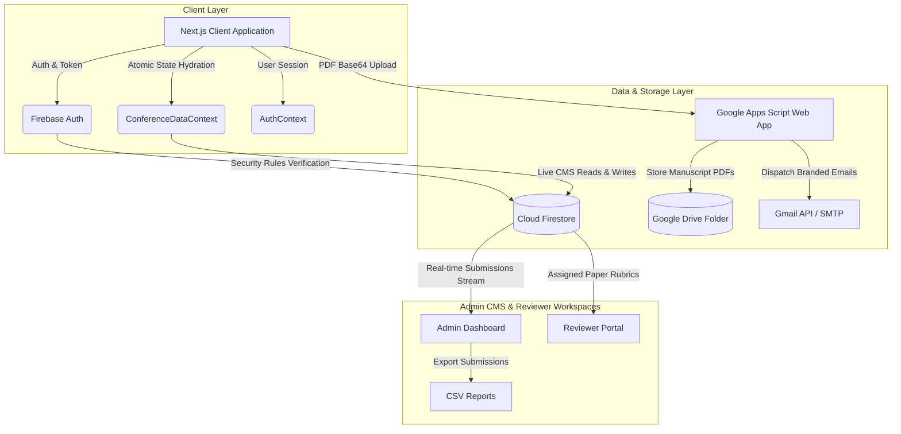
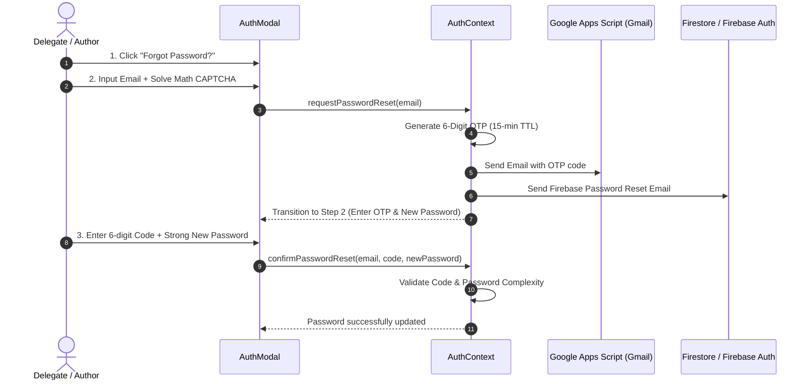

# ESIT International Conference Management & Submission Portal
## Comprehensive System Architecture & Developer Documentation

---

## 1. Executive Summary

The **ESIT International Conference Portal** is an enterprise-grade, one-page academic conference management system built with **Next.js (App Router)**, **React**, **TypeScript**, **Google Cloud Firestore**, **Firebase Authentication**, and **Google Apps Script (Gmail API + Google Drive)**.

It provides a seamless, high-performance experience for:
- **Conference Attendees & Authors**: Discover conference themes, keynotes, dates, tracks, pricing, venue details, past proceedings, and submit double-blind manuscripts with direct PDF storage to Google Drive.
- **Technical Reviewers**: Access a dedicated blind review workspace to evaluate assigned submissions, score papers against structured rubrics, and provide feedback.
- **Conference Secretariat & Administrators**: Full live CMS control over all website content (hero, colors, keynotes, dates, committees, sponsors, archive), submission pipeline tracking, reviewer assignments, status decisions, and transactional email dispatches.

---

## 2. Technology Stack & Cloud Architecture



### Core Technologies
| Layer | Technology | Purpose |
| :--- | :--- | :--- |
| **Framework** | [Next.js (v16.3+ Turbopack)](https://nextjs.org/) | App Router, SSR/CSR optimization, zero layout shift |
| **Language** | [TypeScript](https://www.typescriptlang.org/) | Strict type safety, shared interfaces across frontend & API |
| **UI Styling** | Vanilla CSS Design System | Responsive layout, modern aesthetics, custom color picker |
| **Icons** | [Lucide React](https://lucide.dev/) | Consistent iconography throughout portals & CMS |
| **Authentication** | [Firebase Authentication](https://firebase.google.com/docs/auth) | Email/Password auth, session management, password resets |
| **Database** | [Cloud Firestore](https://firebase.google.com/docs/firestore) | Real-time NoSQL database with atomic document transactions |
| **File Storage** | [Google Drive API](https://developers.google.com/drive) | PDF manuscript storage via Google Apps Script |
| **Email Service** | [Google Apps Script / Gmail API](https://developers.google.com/apps-script) | Transactional email dispatch without CORS preflight failures |

---

## 3. Directory Structure

```text
conference/
├── firestore.rules                         # Cloud Firestore security rules
├── next.config.ts                          # Next.js configuration (Turbopack, domains)
├── package.json                            # Dependencies and build scripts
├── tsconfig.json                           # TypeScript configuration
├── scripts/
│   └── google-apps-script-email.js         # Complete Google Apps Script backend (Drive & Gmail)
└── src/
    ├── app/
    │   ├── api/
    │   │   └── submit-manuscript/
    │   │       └── route.ts                # Next.js API route for manuscript uploads
    │   ├── favicon.ico
    │   ├── globals.css                     # Global styles, animations, variables
    │   ├── layout.tsx                      # Root HTML layout, font injection
    │   └── page.tsx                        # Main landing page orchestrating all sections
    ├── components/
    │   ├── admin/
    │   │   └── AdminDashboard.tsx          # Full-featured Secretariat CMS & Review Manager
    │   ├── common/
    │   │   ├── DynamicBackground.tsx       # Subtle geometric animated background
    │   │   └── FloatingScrollTop.tsx       # Quick scroll-to-top button
    │   ├── landing/
    │   │   ├── CommitteeSection.tsx        # Organizing & Scientific Committee hierarchy
    │   │   ├── HeroSection.tsx             # Banner, dynamic dates, customizable palette
    │   │   ├── ImportantDatesSection.tsx   # Milestone countdown and timeline
    │   │   ├── ImportantNewsSection.tsx    # Announcements and bulletin cards
    │   │   ├── KeynoteSpeakersSection.tsx  # Keynote profiles with Google Drive images
    │   │   ├── PreviousConferencesSection.tsx # Past proceedings and photo archives
    │   │   ├── QuickInfoCards.tsx          # Summary badges (Scopus, dates, venue)
    │   │   ├── RegistrationPricingSection.tsx # Registration fees & bank transfer info
    │   │   ├── SponsorsSection.tsx         # Logos of organizers & academic partners
    │   │   ├── TracksTopicsSection.tsx     # Technical tracks & author/reviewer guides
    │   │   └── VenueSection.tsx            # Hotel, travel, airport, Google Maps
    │   ├── layout/
    │   │   ├── Footer.tsx                  # Footer links, copyright, PDPA button
    │   │   └── Navbar.tsx                  # Sticky responsive navbar with role badge
    │   └── modals/
    │       ├── AuthModal.tsx               # Login, registration, password recovery (OTP)
    │       ├── MySubmissionsModal.tsx      # Author manuscript tracking portal
    │       ├── NewsDetailModal.tsx         # Modal displaying full news announcement
    │       ├── PDPAPrivacyModal.tsx        # PDPA & data protection compliance modal
    │       ├── ReviewerPortalModal.tsx     # Double-blind peer evaluation workspace
    │       └── SubmitManuscriptModal.tsx   # Multi-step manuscript submission wizard
    └── lib/
        ├── context/
        │   ├── AuthContext.tsx             # Authentication provider, roles, OTP resets
        │   └── ConferenceDataContext.tsx   # Real-time conference CMS state manager
        ├── data/
        │   ├── initialConferenceData.ts    # Default conference data seed
        │   └── initialEmailTemplates.ts    # Pre-configured transactional email templates
        ├── email/
        │   └── emailService.ts             # Webhook dispatcher to Google Apps Script
        ├── firebase/
        │   └── config.ts                   # Firebase App, Auth, Firestore initialization
        ├── review/
        │   └── reviewService.ts            # Reviewer assignment and evaluation engine
        ├── security/
        │   └── captchaHelper.ts            # Anti-bot math CAPTCHA and password validator
        ├── submission/
        │   └── submissionService.ts        # Manuscript CRUD operations and tracking
        ├── types.ts                        # Master TypeScript interfaces
        └── utils/
            └── imageUtils.ts               # Google Drive URL parser and converter
```

---

## 4. Key Functional Modules

### 4.1. Public Landing Page & CMS Components
- **Dynamic Hero Section**: Displays edition title, dates, venue, and customizable primary/gradient background colors managed via the Admin Color Picker.
- **Conference Tracks & Guidelines**: Features downloadable IEEE templates, topic taxonomies, and clear author/reviewer submission rules.
- **Sponsors & Academic Partners**: Displays organized partner logos with automatic Google Drive image parsing (`formatGoogleDriveImageUrl`).
- **Previous Conferences Archive**: Showcases historical editions with direct links to:
  - 📅 **Program Schedule** (Google Drive file/PDF)
  - 📖 **Conference Proceedings** (Google Drive file/DOI)
  - 📸 **Photo Album** (Google Drive shared folder)

---

### 4.2. Authentication & Self-Service Password Recovery



- **Enterprise Password Validation**: Enforces length $\ge 8$, uppercase, lowercase, numbers, and special characters with live visual strength metering.
- **Anti-Bot Security CAPTCHA**: Dynamic math challenge prevents brute-force login and spam recovery attempts.
- **PDPA Compliance**: Explicit consent tracking recorded with timestamp upon profile creation.

---

### 4.3. Manuscript Submission Pipeline

1. **Submission Wizard (`SubmitManuscriptModal.tsx`)**:
   - **Step 1**: Title, Abstract, Keywords, Topic Track selection.
   - **Step 2**: Primary Submitter info and dynamic list of Co-Authors.
   - **Step 3**: PDF Document Upload (validates `.pdf` extension, max 25MB).
   - **Step 4**: Author declaration, originality warranty, and PDPA consent.
2. **Drive Storage Backend**:
   - Document converted to Base64 in client and streamed to the Google Apps Script Web App.
   - Saved automatically inside target Google Drive folder: `ESIT_Manuscript_Submissions` (`1A7BPBWVm812p34MAwF06r5G-g-YRP9Od`).
3. **Automated Notification**:
   - Primary author receives immediate `manuscript_submitted` confirmation with tracking ID.
   - All listed co-authors receive individual `coauthor_submission_notification` emails.

---

### 4.4. Double-Blind Peer Review Workspace

- **Reviewer Portal (`ReviewerPortalModal.tsx`)**:
  - Accessible only to users with the `reviewer` role.
  - Anonymized view hiding author details to ensure unbiased double-blind peer review.
  - PDF preview directly opens the uploaded manuscript.
- **Evaluation Criteria**:
  - **Originality & Novelty** (Score 1–5)
  - **Technical Soundness & Methodology** (Score 1–5)
  - **Relevance to Conference Tracks** (Score 1–5)
  - **Organization & Clarity** (Score 1–5)
  - **Recommendation**: *Accept*, *Minor Revision*, *Major Revision*, or *Reject*.
  - **Comments**: Confidential remarks for the Technical Committee and constructive feedback for the Authors.

---

### 4.5. Admin Dashboard & Secretariat CMS

- **Executive Overview**: High-level statistical cards showing total submissions, unassigned papers, papers under review, evaluated count, and acceptance rate.
- **Live Content CMS Tabs**:
  1. `Hero & Colors`: Title, dates, venue, and background color picker.
  2. `Important Dates`: Add, edit, reorder, or extend milestone deadlines.
  3. `News & Updates`: Publish news items with downloadable PDF attachments.
  4. `Keynotes`: Manage speakers, titles, bios, and Google Drive photos.
  5. `Tracks & Guidelines`: Configure categories, topics, and IEEE guidelines.
  6. `Pricing & Bank`: Registration fees, bank name, account number, SWIFT code.
  7. `Committees`: Organize leadership, scientific, and organizing committees.
  8. `Venue & Travel`: Map URL, hotel info, airport transit instructions.
  9. `Sponsors & Partners`: Manage sponsor logos with Google Drive support.
  10. `Past Conferences`: Manage archives with Google Drive links for schedules, proceedings, and photos.
  11. `Submissions Management`: Assign reviewers, view evaluations, update status, and **Export All to CSV**.
  12. `User & Reviewer Roles`: Appoint reviewers, toggle admin permissions, suspend/activate accounts.
  13. `Email Templates`: Edit customizable transactional email templates.
  14. `Email API Tester`: Live testing tool to verify Google Apps Script webhook integration.

---

## 5. Security & Firestore Rules

[`firestore.rules`](file:///i:/WebApp/conference/firestore.rules) implements strict Role-Based Access Control (RBAC):

```javascript
rules_version = '2';

service cloud.firestore {
  match /databases/{database}/documents {
    
    function isAuthenticated() {
      return request.auth != null;
    }

    function isOwner(userId) {
      return isAuthenticated() && request.auth.uid == userId;
    }

    function isAdmin() {
      return isAuthenticated() && (
        request.auth.token.email in ['admin@conference.org', 'esitconf@gmail.com'] ||
        (request.auth.token.email != null && request.auth.token.email.matches('^admin@.*')) ||
        (exists(/databases/$(database)/documents/users/$(request.auth.uid)) &&
         get(/databases/$(database)/documents/users/$(request.auth.uid)).data.roles.hasAny(['admin']))
      );
    }

    function isReviewer() {
      return isAuthenticated() && (
        exists(/databases/$(database)/documents/users/$(request.auth.uid)) &&
        get(/databases/$(database)/documents/users/$(request.auth.uid)).data.roles.hasAny(['reviewer'])
      );
    }

    // 1. Public Content (Landing, Sponsors, Past Conferences)
    match /conference_content/{document} {
      allow read: if true;
      allow write: if isAdmin();
    }

    match /previous_conferences/{document} {
      allow read: if true;
      allow write: if isAdmin();
    }

    // 2. User Profiles
    match /users/{userId} {
      allow read: if isOwner(userId) || isAdmin();
      allow create: if isAuthenticated() && request.auth.uid == userId;
      allow update: if isOwner(userId) || isAdmin();
      allow delete: if isAdmin();
    }

    // 3. Manuscript Submissions
    match /submissions/{submissionId} {
      allow read: if isAdmin() || 
        (isAuthenticated() && resource.data.authorUid == request.auth.uid) ||
        (isAuthenticated() && (
          (resource.data.assignedReviewers != null && (
            request.auth.uid in resource.data.assignedReviewers || 
            request.auth.token.email in resource.data.assignedReviewers
          )) ||
          isReviewer()
        ));
      allow create: if isAuthenticated();
      allow update: if isAdmin() || 
        (isAuthenticated() && resource.data.authorUid == request.auth.uid) ||
        (isAuthenticated() && (
          (resource.data.assignedReviewers != null && (
            request.auth.uid in resource.data.assignedReviewers || 
            request.auth.token.email in resource.data.assignedReviewers
          )) ||
          isReviewer()
        ));
      allow delete: if isAdmin() || (isAuthenticated() && resource.data.authorUid == request.auth.uid);
    }

    // 4. Password Reset Tokens (Temporary OTP verification sessions)
    match /password_resets/{resetId} {
      allow read, create, update, delete: if true;
    }

    // 5. Audit Logs
    match /audit_logs/{logId} {
      allow read: if isAdmin();
      allow create: if isAuthenticated();
      allow update, delete: if false;
    }
  }
}
```

---

## 6. Google Apps Script Configuration

The serverless backend [`google-apps-script-email.js`](file:///i:/WebApp/conference/scripts/google-apps-script-email.js) handles Gmail notifications and Google Drive uploads.

### Setup Instructions
1. Open [Google Apps Script Editor](https://script.google.com).
2. Paste the contents of `scripts/google-apps-script-email.js` into `Code.gs`.
3. Set `TARGET_FOLDER_ID = "1A7BPBWVm812p34MAwF06r5G-g-YRP9Od"`.
4. Run `testAuthorizationAndCreateFolder` to authorize Google Drive & Gmail API permissions.
5. Deploy as Web App:
   - **Execute as**: `Me`
   - **Who has access**: `Anyone`
6. Add the deployment URL to `.env.local`:
   ```env
   NEXT_PUBLIC_GOOGLE_APPS_SCRIPT_EMAIL_URL=https://script.google.com/macros/s/AKfycb.../exec
   NEXT_PUBLIC_EMAIL_SERVICE_SECRET=conference_secret
   ```

---

## 7. Environment Variables Reference

Create a `.env.local` file in the project root:

```env
# Firebase Configuration
NEXT_PUBLIC_FIREBASE_API_KEY=AIzaSy...
NEXT_PUBLIC_FIREBASE_AUTH_DOMAIN=esit-conference.firebaseapp.com
NEXT_PUBLIC_FIREBASE_PROJECT_ID=esit-conference
NEXT_PUBLIC_FIREBASE_STORAGE_BUCKET=esit-conference.appspot.com
NEXT_PUBLIC_FIREBASE_MESSAGING_SENDER_ID=1234567890
NEXT_PUBLIC_FIREBASE_APP_ID=1:1234567890:web:...

# Google Apps Script Email & Drive Webhook
NEXT_PUBLIC_GOOGLE_APPS_SCRIPT_EMAIL_URL=https://script.google.com/macros/s/AKfycbwa0aSvk0VBHls6RSAJ-G1aZfykaBDU8TzFDfnDo9A42Kk5nepBTjZ9GpdOvPGWxQ1P/exec
NEXT_PUBLIC_EMAIL_SERVICE_SECRET=conference_secret

# Anti-Bot Security (Optional)
RECAPTCHA_SECRET_KEY=
NEXT_PUBLIC_RECAPTCHA_SITE_KEY=
```

---

## 8. Build & Verification Commands

```bash
# 1. Install dependencies
npm install

# 2. Run local development server
npm run dev

# 3. Compile and validate production build with Turbopack
npm run build

# 4. Start production server
npm run start
```
